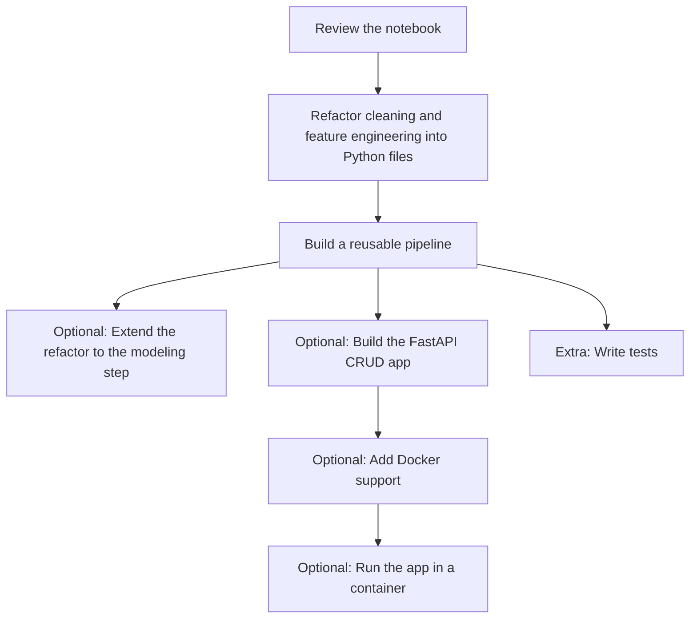

# Project for Today

You will work with the [King County Jupyter notebook](./King-County.ipynb), which already contains exploratory data analysis, data cleaning, feature engineering, and several machine learning models. The required libraries are listed in [requirements.txt](./requirements.txt).

The main focus of this project is the refactoring of the data cleaning and feature engineering workflow. The modeling section stays in the notebook so you can see how those transformed features are used later in a full machine learning workflow.

## Main tasks

- Refactor the data cleaning and feature engineering code into Python files.
- Build a reusable pipeline for data cleaning and feature engineering.

### Stretch tasks

- Refactor the modeling step as well, or extend your pipeline so it also supports the training workflow.
- Build a FastAPI app that supports Create, Read, Update and Delete operations for houses stored in a database, using 5 features.
- Create a `Dockerfile` for the app.
- Run the app inside a Docker container.

If you want a working reference for this optional stretch goal, see [bonus_solution/](./bonus_solution/). It includes a minimal FastAPI + Postgres + Docker example and is meant as a guide, not a required structure.

### Extra (if you still have time)

- Write tests.

## Answer the following questions in `README.md`

- What steps did you take to complete the project?
- What challenges did you face?
- What would you do differently if you had more time?
